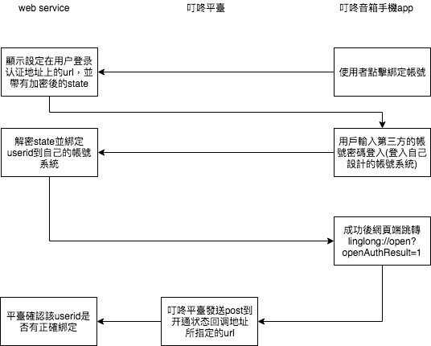

## 叮咚測試

### 目的：

建立一個'叮咚開放平臺'的應用，串接到我們自己的平臺，</br>
使'叮咚音箱'可以透過對話來完成我們的行爲目的，</br>
利用'java'撰寫後臺web service來串聯。</br>

### 標題：

1. 叮咚開放平臺簡介
2. abnf文法應用範例
3. java web service實現
4. 參考

### 叮咚開放平臺簡介：

#### 交互流程：


#### 註冊過程：

1. 基本信息：

    這邊要注意兩個地方，
    1) 应用调用名称
    2) 开发语言

    應用調用名稱需要加入他們的官方QQ群組，並請他們幫你開通才可以使用。

    QQ1群：201569263，QQ2群：518888507

    那這個應用調用名稱用在哪理呢？
    例如： 叮咚叮咚(音箱喚醒語)，請 滴滴(應用調用名稱) 帮我叫一辆从朝林广场到北京南站的出租车

    第二個很重要的開發語言，牽扯到應用使用者綁定叮咚平臺時所使用的加密方式。
    所以務必要選擇正確，詳細部分等等會提到。

2. 服務信息：

* 应用服务地址: 這是叮咚雲端會發送post到你的應用的連結點，也就是所謂的'webhook'。

* 用户登录认证：
這會影響是否需要讓你應用的使用者綁定到叮咚的userid。
用簡單的例子來說明，如果你的應用是"今天天氣如何"，那麼不用去知道是誰說的，是一個獨立功能，所以不需要綁定使用者。
但是如果你的應用是"幫我打開電視"，那你的應用就需要知道是"誰的電視"，所以必須要跟你的使用者綁在一起。

* 這邊只介紹 web页面认证：
  1) 用户登录认证地址： 用來登入用的網頁
  2) 登录认证AesKey:
     ```
     在用户申请开通应用时，叮咚开放平台会在上述配置的用户登录认证地址中，通过“state”参数返回用户userid。
     state 参数格式为json：
     {"userid":"用户标识","operation":"oauth","timestamp":"时间戳，毫秒","appid":"应用的APPID"}

     叮咚开放平台对state参数的加密过程（采用ECB模式，128位秘钥）
     1.叮咚开放平台使用应用配置的AesKey秘钥进行state 参数的加密 state_mi = AES.encrypt(state_ming,AesKey)
     2.叮咚开放平台将加密后的数据进行Base64编码 state_base64 = Base64.encode(state_mi)
     3.叮咚开放平台将Base64编码后的数据进行URL编码 state = UrlEncoder.encode(state_base64,"UTF-8");
     应用对state参数的解密过程
     1.应用将接收到的数据进行Url解码，state_base64 = UrlDecoder.decode(state,"UTF-8")
     2.应用将解码后到的数据进行Base64解码 state_mi = Base64.decode(state_base64)
     3.应用使用应用配置的AesKey秘钥进行数据的解密 state = AES.decrypt(state_mi,AesKey)
     注意： 用户登录认证成功后，应用云端需要进行重定向到：linglong://open?openAuthResult=1。其中，openAuthResult为1标识成功，其他表示失败
     ```
     以上是官方說明，下面是我做的圖來解釋
     

3. 参数设置:

* 用户信息配置地址:
  用來個人化你的應用，一樣是網頁操作，他會在你設定的url上面帶一個state的query
  把所設定的webservice多帶上那個query就可以辨別使用者了

* 开通状态回调地址:
  這是先前提到的'用戶登入步驟'所使用到的地址，讓叮咚平臺判斷是否綁定成功

* 回调地址参数秘钥：
  用於加密'开通状态回调地址'的url裏的state query

#### 加密方式：

  aes所使用的加密是需要一個128bit的密鑰，換算成字元是16個bytes，
  跟文檔所提到的128個字元上衝突的，
  其實他真正的aes key是把你所填入的密鑰，再取md5的hash值。
  那個md5的值就恰好是128bit。

  另外要注意的是，java的加密方式跟其他語言是不一樣的。
  java不是把密鑰取md5，而是隨機產生一個含有該密鑰當做種子的密鑰。
  直接看code:
  ```java

  	public static String decryptAES128(String text) throws Exception {
  		// text = URLDecoder.decode(text, "utf-8"); 不做url decode
  		KeyGenerator kgen = KeyGenerator.getInstance("AES");
  		SecureRandom secureRandom = SecureRandom.getInstance("SHA1PRNG");
      // 這裏的key.getBytes()的 key 就是在註冊時所填入的密鑰，長度是128bytes
  		secureRandom.setSeed(key.getBytes());
  		kgen.init(128, secureRandom);
  		SecretKey secretKey = kgen.generateKey();
  		byte[] enCodeFormat = secretKey.getEncoded();
  		SecretKeySpec sKey = new SecretKeySpec(enCodeFormat, "AES");
  		Cipher cipher = Cipher.getInstance("AES/ECB/PKCS5Padding");
  		cipher.init(Cipher.DECRYPT_MODE, sKey);
  		byte[] data = Base64.getDecoder().decode(text);

  		return new String(cipher.doFinal(data));
  	}
  ```

### abnf文法應用範例

```
#ABNF 1.0 UTF-8;
//應用名稱
business MyApp;
//插入字典
#include "pre_word.lst"
root main;
#ABNF HEAD-END;


//业务唤醒前缀词
$pre_word = ($u_LST_pre_word);

/*业务唤醒名称，音箱输入："打开考拉FM"，进入应用，建议做容错处理，如
	"$l_bizname{bizname%考拉}=考拉[fm|FM]"，
	"$l_bizname{bizname%e袋洗} = (一|E|e|1|以|一)(袋洗|代洗|代谢|戴茜|代新)"
*/
$l_bizname{bizname} = 小飞飞;

/*业务唤醒,唤醒业务方式如下，
	1、前缀词+业务唤醒词；
	2、前缀词+业务唤醒词+用户意图；
	3、进入业务流程后，之后用户可以直接交互，不需要加业务唤醒词
*/
$c_bizname = [$pre_word]$l_bizname;

$want = 要|想|想要;
$query{operation%query} = (查|查询|看|知道|告诉)[一下];

$open{operation%open} = 开|打开|开启;
$close{operation%close} = 关|关闭;

$cmd{cmd} =  $_ti_ch_`-0.4`<2-10>;
$noise{noise} =  $_ti_ch_<1-20>;

$ask_content = [帮][我] ($open|$close|$query) $cmd;

/*玛利亚幫我查北京今天的天氣情況
*/

$main{biz:infairy_cocina} = [$noise]|( [$_ti_ch_<5->] [$c_bizname] [$_ti_ch_<5->] $ask_content) ;
```

### java web service實現

#### 交互状态

<table border="1" cellspacing="0" cellpadding="0">
 <tbody><tr>
  <td class="title">状态</td>
  <td class="title">说明</td>
 </tr>
 <tr>
  <td>LAUNCH</td>
  <td>用户只输入了应用名称无具体意图时的状态,可以理解为当前应用的会话启动</td>
 </tr>
 <tr>
  <td>INTENT</td>
  <td>用户输入的内容具有某个应用的具体意图时的状态，会话开始时可以理解为带有意图的启动，在会话中是可以理解为正在交互的内容。</td>
 </tr>
 <tr>
  <td>NOTICE</td>
  <td>在与用户交互的过程中，用户的输入不能识别出具体的意图时，音箱会开启重复询问，在询问的过程中也会异步地将用户的输入发送给开发者应用。注：这种状态下的报文，不是用来交互的，而且是异步延迟发送的，目的只是把数据日志给到应用，供应用端进行用户话术的分析，改进VUI的交互设计。</td>
 </tr>
 <tr>
  <td>END</td>
  <td>用户退出应用，或会话总次数超出平台次数限制。</td>
 </tr>
</tbody></table>

#### servlet:

```java
  @Override
	protected void doPost(HttpServletRequest req, HttpServletResponse resp) throws ServletException, IOException {
		// TODO Auto-generated method stub
		resp.setContentType("application/json;charset=UTF-8");
		resp.addHeader("Accept-Charset", "UTF-8");
		resp.addHeader("Accept", "application/json");
		long timestamp = System.currentTimeMillis();
		resp.addHeader("timestamp", timestamp + "");
		String input = OsgiServletUtil.getString(req.getInputStream());

		DingDongReq dReq = gson.fromJson(input, DingDongReq.class);

		switch (dReq.getStatus()) {
		case LAUNCH:
			//ignore
			break;
		case NOTICE:
			// ignore
			break;
		case INTENT:
			dealIntent(dReq, req, resp, timestamp);
			break;
		case END:
			// ignore
			break;

		default:
			// ignore
			break;
		}
	}

	private void dealIntent(DingDongReq dReq, HttpServletRequest req, HttpServletResponse resp, long timestamp)
			throws IOException {
		// TODO Auto-generated method stub

		DingDongResp dResp = new DingDongResp();
		dResp.setIsEnd(false);

    //檢查帳號是否存在
		Account ac = cocinaManager.getAccount(dReq.getUser().getUser_id());

		String msg = "抱歉沒聽請楚，麻煩再說一次";

		if (ac != null) {
			Session session = dReq.getSession();

			Map<String, String> attr = session.getAttributes();

			String cmd = attr.get("cmd");
			String operation = attr.get("operation");

			if (cmd != null) {
				if (operation.equals("open")) {
					cmd = "打開" + cmd;
				} else if (operation.equals("close")) {
					cmd = "關閉" + cmd;
				}
				log.info("relay in = {}", cmd);
				try {
					msg = sendRelayVR(cmd, ac.getMac(), ac.getToken());
					log.info("relay resp = {}", msg);
				} catch (Exception e) {
					log.error("e:", e);
				}
				dResp.setRepeatDirective(DirectiveBuilder.newBuilder()//
						.addItem("還有什麼問題嗎？", "1")//
						.build());
			}
		} else {
			msg = "很抱歉，找不到您的帳號，請重新綁定";
		}

		dResp.setVersionid(dReq.getVersionid());
		dResp.setSequence(dReq.getSequence());
		dResp.setTimestamp(timestamp);
		dResp.setDirective(DirectiveBuilder.newBuilder()//
				.addItem(msg, "1")//
				.build());

		String output = gson.toJson(dResp);

		log.info("output = {}", output);
		resp.getWriter().append(output).close();
	}

  //處理登入的web service
  private void doLogin(HttpServletRequest req, HttpServletResponse resp, String input) {
    JSONObject obj = new JSONObject(input);
    String state = obj.getString("state");
    String ac = obj.getString("ac");
    String pw = obj.getString("pw");
    resp.setContentType("application/json; charset=utf-8;");

    try {
      //解碼state
      String stateJson = Tool.decryptAES128(state);
      String userid = new JSONObject(stateJson).getString("userid");

      //連接你的平臺帳號系統
      ...

      //綁定叮咚userid到平臺帳號
      Account account = new Account();
      ...
      cocinaManager.putAccount(account);

      resp.getWriter().append("{\"status\":\"success\"}");
      resp.setStatus(200);

    } catch (Exception e) {
      e.printStackTrace();
      resp.setStatus(400);
    }

  }

  //處理开通状态回调
	@Override
	protected void doGet(HttpServletRequest req, HttpServletResponse resp) throws ServletException, IOException {

		String state = req.getParameter("state");
		log.info("state = {}", state);

		try {
			String json = Tool.decryptAES128(state);
			log.info("json = {}", json);
			JSONObject obj = new JSONObject(json);
			String userid = obj.getString("userid");
			String operation = obj.getString("operation");

			Account ac = cocinaManager.getAccount(userid);

			if ("close".equals(operation)) {
				if (ac != null) {
					cocinaManager.rmAccount(userid);
					resp.getWriter().append("0").close();
				} else {
					resp.getWriter().append("1").close();
				}
			} else if ("open".equals(operation)) {
				if (ac != null) {
					resp.getWriter().append("0").close();
				} else {
					resp.getWriter().append("1").close();
				}
			}
		} catch (Exception e) {
			log.error("e", e);
		}

	}
```

#### pojo部分請參考 code/DingDongTest/pojo/*

### 參考：

* http://open.linglongtech.com/openweb/docs/index#_wenfayanzheng
* http://open.linglongtech.com/openweb/static/download/ABNF_open1.1.pdf
