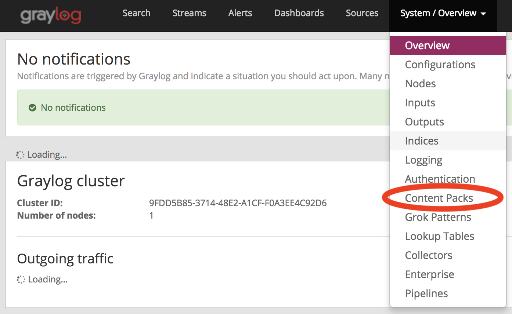
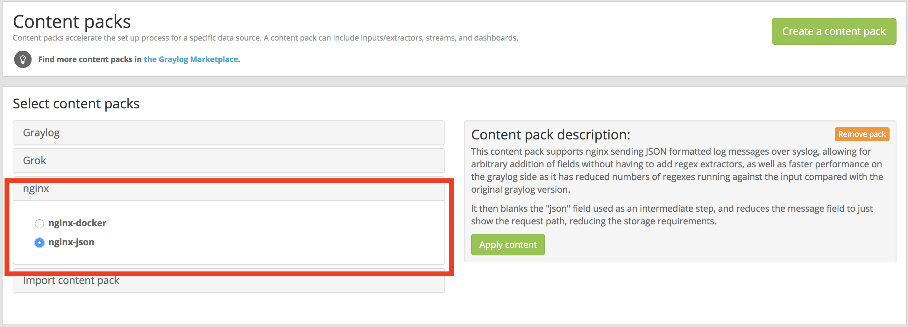
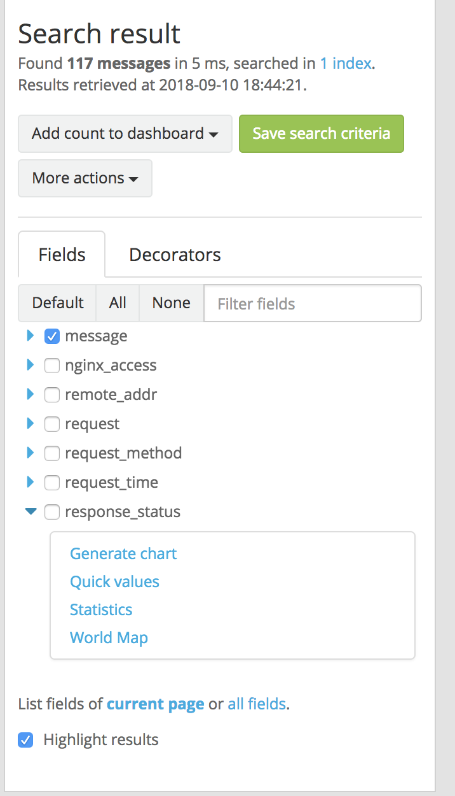
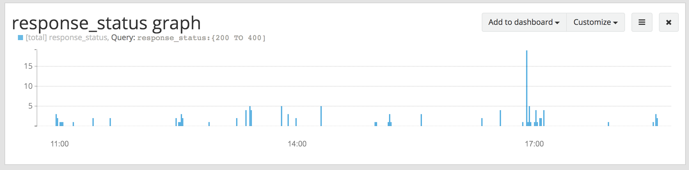
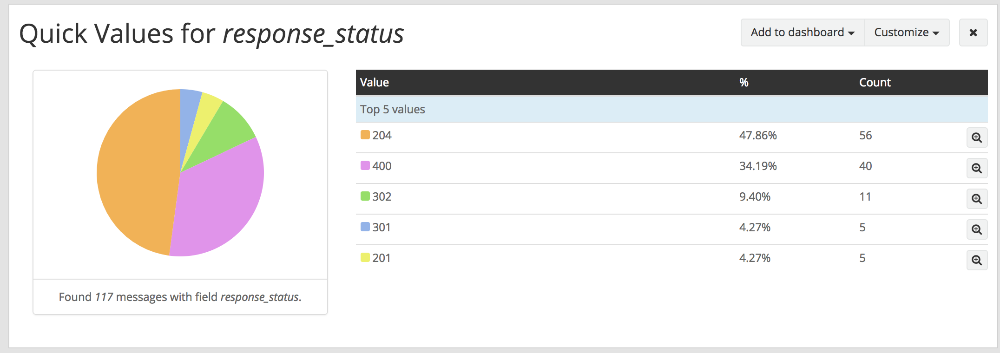
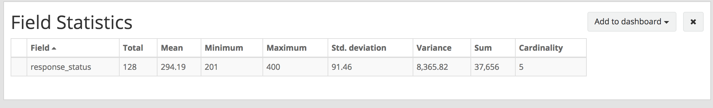

## Graylog docker stack 建立

### 參考：
* https://hub.docker.com/r/graylog/graylog/
* https://community.graylog.org/t/graylog-heap-size-on-docker/2545
* https://docs.graylog.org/
* https://marketplace.graylog.org/addons/6b867cbe-8f5b-4fc9-84d2-fc1a75a0830d
* http://docs.graylog.org/en/2.4/pages/queries.html

### 簡介：

* 日誌管理工具：收集，解析，可視化。
* 整理各種不同的log記錄，可以支援來自不同的主機、程式、虛擬機。
* 可自定log的schema，有市集可以下載現成的
* 簡單的搜尋語法，並可匯出elasticsearch語法利於開發
* 利用docker方便部屬


### 支援輸入：

* Syslog (TCP, UDP, AMQP, Kafka)
* GELF (TCP, UDP, AMQP, Kafka, HTTP)
* AWS (AWS Logs, FlowLogs, CloudTrail)
* Beats/Logstash
* CEF (TCP, UDP, AMQP, Kafka)
* JSON Path from HTTP API
* Netflow (UDP)
* Plain/Raw Text (TCP, UDP, AMQP, Kafka)

### 安裝：

請先安裝好docker ,docker-compose,docker swarm</br>

docker-compose.yml:
``` yaml
version: '3.4'
services:
    mongo:
      image: mongo:3
      volumes:
          - ./mongo/db:/data/db
      networks:
          graylogend:
    elasticsearch:
      image: elasticsearch:5.6.9
      environment:
          - http.host=0.0.0.0
          - xpack.security.enabled=false
          - transport.host=localhost
          - network.host=0.0.0.0
          # Disable X-Pack security: https://www.elastic.co/guide/en/elasticsearch/reference/5.5/security-settings.html#general-security-settings
          - "ES_JAVA_OPTS=-Xms384m -Xmx384m"
      volumes:
          - ./elasticsearch/data:/usr/share/elasticsearch/data
      networks:
          graylogend:
      ulimits:
        memlock:
          soft: -1
          hard: -1

    graylog:
      image: graylog/graylog:2.4
      volumes:
          - /etc/localtime:/etc/localtime:ro
          - ./graylog/data/journal:/usr/share/graylog/data/journal
          - ./graylog/data/config:/usr/share/graylog/data/config
      environment:
          - GRAYLOG_SERVER_JAVA_OPTS=-Xms384m -Xmx384m -XX:+UnlockExperimentalVMOptions -XX:+UseCGroupMemoryLimitForHeap -XX:NewRatio=1 -XX:MaxMetaspaceSize=256m -server -XX:+ResizeTLAB -XX:+UseConcMarkSweepGC -XX:+CMSConcurrentMTEnabled -XX:+CMSClassUnloadingEnabled -XX:+UseParNewGC -XX:-OmitStackTraceInFastThrow
          - GRAYLOG_WEB_ENDPOINT_URI=https://graylog.mycasa.care/api
          - GRAYLOG_PASSWORD_SECRET=somepasswordpepper
          - GRAYLOG_ROOT_PASSWORD_SHA2=yourpassword_SHA2
          # Password: admin
      depends_on:
          - mongo
          - elasticsearch
      networks:
          frontend:
              aliases:
                  - graylog
          graylogend:
      ports:
          - 514:514/udp
          - 514:514
          - 12201:12201
          - 12201:12201/udp
      expose:
          - 9000

    nginx:
      image: nginx/nginx:latest
      depends_on:
          - graylog
      volumes:
          - /etc/localtime:/etc/localtime:ro
          - ./nginx/nginx.conf:/etc/nginx/conf.d/my.conf
      environment:
          - "TZ=Asia/Taipei"
      networks:
          frontend:
      ports:
          - 80:80
          - 443:443
networks:
    frontend:
```

#### mongo db:
負責單純記錄graylog的schema

#### elasticsearch:
負責搜尋log用</br>
參數: </br>
ES_JAVA_OPTS: 調整JAVA參數，範例爲調整JVM記憶體大小

#### graylog:
web界面、連線終端。 </br>
參數: </br>
GRAYLOG_SERVER_JAVA_OPTS: 從dockerfile 摳來的，多增加了JAM大小</br>
GRAYLOG_WEB_ENDPOINT_URI： 終端URI</br>
GRAYLOG_ROOT_PASSWORD_SHA2： admin的sha2密碼</br>
ports的部分可以依照inputs的需求開</br>

#### nginx:
web server，本範例拿來提供log用。</br>
參數：</br>
volumes: ./nginx/nginx.conf -> 設定virturl host以及log 例：
```javascript

  server {
    listen 80;
    server_name $SERVER_NAME;
    root $ROOT_PATH;
    index index.php index.html index.htm;

    allow all;

    location / {
      set_real_ip_from 0.0.0.0/0;
      real_ip_header X-Real-IP;
      real_ip_recursive on;

      proxy_redirect off;

      proxy_set_header Host \$host;

      proxy_set_header X-Real-IP \$remote_addr;

      proxy_set_header X-Forwarded-For \$proxy_add_x_forwarded_for;

      proxy_next_upstream error timeout invalid_header http_500;

      proxy_connect_timeout 10s;

      proxy_read_timeout 10s;
      proxy_pass http://graylog:9000;

      error_page 404 /404.html;


      # WebSocket support
      proxy_http_version 1.1;
      proxy_set_header Upgrade \$http_upgrade;
      proxy_set_header Connection "upgrade";
    }
  }
log_format graylog2_json escape=json '{ "timestamp": "$time_iso8601", '
                  '"remote_addr": "$remote_addr", '
                  '"body_bytes_sent": $body_bytes_sent, '
                  '"request_time": $request_time, '
                  '"response_status": $status, '
                  '"request": "$request", '
                  '"request_method": "$request_method", '
                  '"host": "$host",'
                  '"upstream_cache_status": "$upstream_cache_status",'
                  '"upstream_addr": "$upstream_addr",'
                  '"http_x_forwarded_for": "$http_x_forwarded_for",'
                  '"http_referrer": "$http_referer", '
                  '"http_user_agent": "$http_user_agent" }';

access_log syslog:server=graylog:12301,facility=local0,tag=nginx,severity=info graylog2_json;
error_log syslog:server=graylog:12302,facility=local0,tag=nginx,severity=warn;
```

#### 設定graylog:

1. 啟動`docker-compose up -d`，瀏覽`http://$SERVER_NAME` </br>
2. 選擇Content packs: 
3. 前往 https://marketplace.graylog.org/addons/6b867cbe-8f5b-4fc9-84d2-fc1a75a0830d 下載並解壓縮
4. 回到Content packs點擊`Import content pack` 選擇剛才解壓縮的`contenpack.json`並上傳
5. `Select content packs`會多出`nginx`的選項，選擇`nginx-json`然後點選旁編的`Apply content`。 
6. 到此爲止設定完畢，點選toolbar的`Search`即可看到log記錄。

### 常用query：

* 訊息包含abc: `abc`
* 訊息包含abc或def: `abc def`
* 訊息完整包含api cmd: `"api cmd"`
* 查詢某欄位的abc: `field:abc`
* 查詢某欄位的abc或def: `field:(abc def)`
* 訊息有包含header這個欄位: `_exists_:header`
* 用正規表達式: /[0-9]+/
* 支援operater: `AND OR NOT`
* Wildcards: `*`取代零到多個字，`?`取代一個字
* 糢糊搜尋: `~`類似sql的`%`
* 範圍: `{}`爲不包含`[]`爲包含，如:`response_status:{200 TO 400]` 顯示201~400</br>
  也可以單邊界搜尋：`response_status:>=400]`</br>
  也可以混和條件: `response_status:(>=400 AND <500)`
* 下面爲特殊字元，需加反斜線`\`:</br>
  `&& || : \ / + - ! ( ) { } [ ] ^ " ~ * ?`
* 下面爲可用的時間搜尋:
```
`1st of april to 2 days ago`
`4 hours ago`
`last month`
`yesterday midnight +0200 to today midnight +0200`
```

### 操作圖形：


* chart:

* Quick Values:

* Field Statistics:


### 装饰器:

### log保留時限：

### 計算log可能的大小：
GB/day x Ret. Days x 1.3 = storage req.
