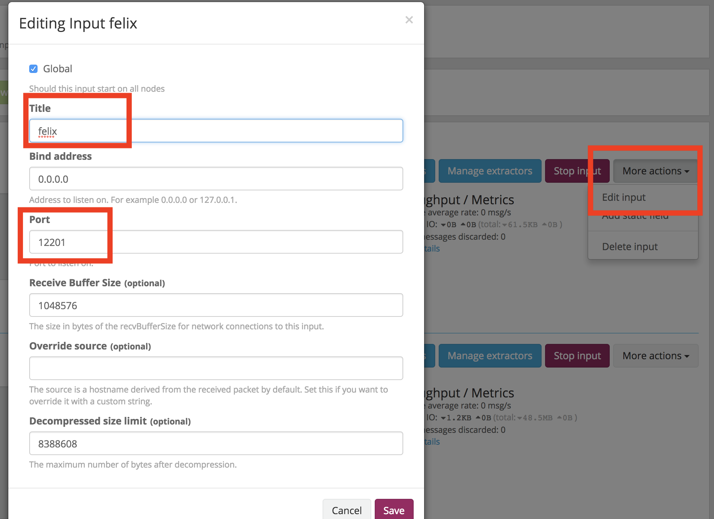
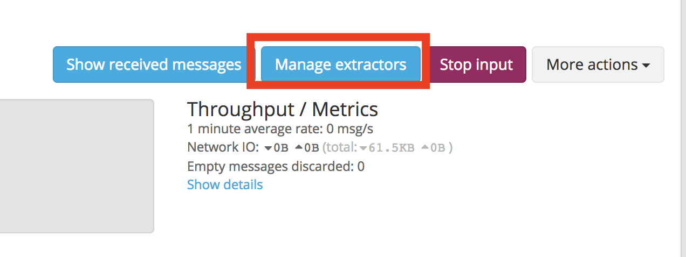
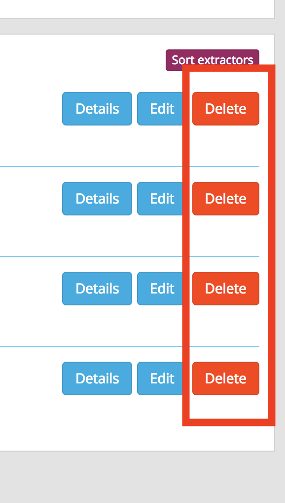
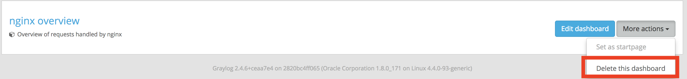

## 在docker中利用log4j把log傳到graylog

### 環境：

* dcoker swarm mode
* java環境：apache felix osgi,jre9
* log4j版本：1.2.17

### 簡介：

利用graylog所提供的gelf(The Graylog Extended Log Format )格式，透過udp的方式傳送到graylog伺服器存放。

### osgi建立graylog appender bundle:

1. 建立一個bundle , bnd檔爲：
```yaml
-buildpath: \
	osgi.annotation;version=6.0.1,\
	osgi.core;version=6.0,\
	osgi.cmpn;version=6.0,\
	gelfj-1.1.16.jar;version=file,\
	amqp-client-3.0.4.jar;version=file,\
	json-simple-1.1.1.jar;version=file,\
	/Users/user-name/.m2/repository/log4j/log4j/1.2.17/log4j-1.2.17.jar;version=file

-testpath: \
	${junit}

javac.source: 9
javac.target: 9

Bundle-Version: 0.0.0.${tstamp}

Export-Package: \
	org.graylog2,\
	org.graylog2.log,\
	com.rabbitmq.client,\
	org.json.simple.parser,\
	org.json.simple,\
	org.graylog2.logging
Import-Package: \
	,\
	*
Private-Package: \
	com.rabbitmq.client.impl,\
	com.rabbitmq.utility,\
	graylog
```

  這段程式碼的重點在於：
  1) 下載`gelfj-1.1.16.jar`到專案目錄下面（`https://mvnrepository.com/artifact/org.graylog2/gelfj/1.1.16`），這個jar提供了graylog appender。
  2) 下載`amqp-client-3.0.4.jar`(`https://mvnrepository.com/artifact/com.rabbitmq/amqp-client/3.0.4`),</br>
  `json-simple-1.1.1.jar`(`https://mvnrepository.com/artifact/com.googlecode.json-simple/json-simple/1.1.1`)到專案目錄下面，提供graylog的依賴。
  3) 提供osgi graylog相關的packages
  4) 建立一個私有地package `graylog`用來建立graylog appender

2. 建立一個class在`graylog` package:
```JAVA
package graylog;

import org.apache.log4j.Logger;
import org.apache.log4j.PatternLayout;
import org.apache.log4j.PropertyConfigurator;
import org.graylog2.log.GelfAppender;
import org.osgi.framework.BundleContext;
import org.osgi.framework.wiring.BundleWiring;
import org.osgi.service.component.annotations.Activate;
import org.osgi.service.component.annotations.Component;

@Component
public class Activator {

	@Activate
	public void start(BundleContext context) {

		ClassLoader ctl = Thread.currentThread().getContextClassLoader();
		BundleWiring bundleWiring = context.getBundle().adapt(BundleWiring.class);

		Thread.currentThread().setContextClassLoader(bundleWiring.getClassLoader());
		try {
			PropertyConfigurator.configure("conf/log4j.properties");
			Logger log = org.apache.log4j.Logger.getRootLogger();

			GelfAppender gap = new GelfAppender();
      //設定傳到graylog時顯示的feild:`source`
			gap.setOriginHost("felix");
      //設定graylog的伺服器domain
			gap.setGraylogHost("graylog");
      //設定facility feild
			gap.setFacility("gelf-java");
      //使用預設的pattern
			gap.setLayout(new PatternLayout());
      //記錄額外的stacktrace
			gap.setExtractStacktrace(true);
      //記錄額外的資訊
			gap.setAddExtendedInformation(true);
      //記錄額外的欄位`EDV`,`MyAPP`
			gap.setAdditionalFields("{'environment': 'DEV', 'application': 'MyAPP'}");
      //啓用這個appender
			gap.activateOptions();
			log.addAppender(gap);

			log.info("start graylog");

		} finally {
			// TODO: handle finally clause
			Thread.currentThread().setContextClassLoader(ctl);
		}

	}

}

```

  這段程式碼的重點在於：
  1) 把mainclassloader換成這個bundle提供的classloader，才能正確度的找到graylog appender
  2) PropertyConfigurator讀取了log4j的設定檔
  3) `Logger log = org.apache.log4j.Logger.getRootLogger()`取得了這個log的rootlogger
  4) `log.addAppender(gap);`把設定好的graylog加進去rootlogger

### 設定graylog server透過web:

1. 到web界面選擇Content packs: 
2. 前往 https://marketplace.graylog.org/addons/7768ddf3-d368-479a-bb0e-a6cb527c1bc2 下載並解壓縮
3. 回到Content packs點擊`Import content pack` 選擇剛才解壓縮的`contenpack.json`並上傳
4. `Select content packs`會多出`nginx`的選項，選擇`nginx-docker`然後點選旁編的`Apply content`。</br>
   這邊特別說明下載`nginx-docker`是爲了要使用它的`gelf`格式，因爲`graylog2.4`版本預設並沒有提供這樣的格式。
5. 進入`inputs`頁面，編輯剛剛新增的`nginx-log` 
   注意port改爲graylog appender預設的`12201`，名稱改爲`felix`，儲存後就應該可以看到資料進來了。
6. 最後刪除用不到的extrator  
   刪除`dashbroad` 
