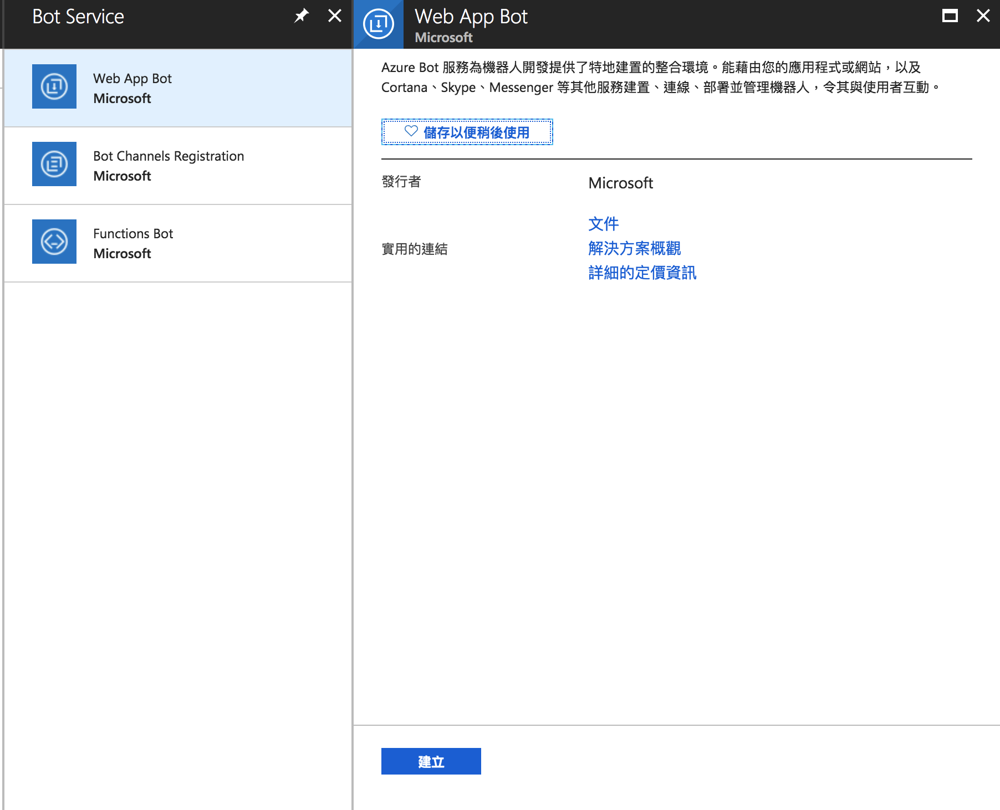

## skypebot 從零開始

### 準備工具：
* 作業系統: ubuntu 16.0.1
* nodejs: v10.9.0
* npm: 6.4.1
* 一個microsoft帳號
* 一個自己的網域（需要有https 可用letsencript 筆者是用cloudflare）

### 參考文件：
* https://docs.microsoft.com/en-us/azure/bot-service/nodejs/bot-builder-nodejs-quickstart?view=azure-bot-service-3.0

### 申請Azure並建立bot:

註： 以下爲免費適用帳號</br>

1. 進入 https://azure.microsoft.com/en-us/free/ 並按照步驟完成註冊
2. 完成上述步驟後會進入儀表板 
3. 在所有服務那邊搜尋`bot`，選擇`bot服務`並建立 
4. 依照顯示的選項填即可，要注意的是定價層那邊選免費的
5. 接着等待他建立，大概5分鐘內會建立完成，等他建立完成的期間我們先去建立bot service

### 用nodejs快速建立bot:

1. 安裝所需的程式
``` bash
npm install -g yo
npm install -g generator-botbuilder@preview
```
2. 利用genrator快速建立樣板
``` bash
yo botbuilder
```
3. 選擇bot名字,剩下的都enter帶過
4. 現在會有一個新資料夾，名字是你的bot，我們進去並用編輯器打開app.js
``` javascript
const { BotFrameworkAdapter, MemoryStorage, ConversationState } = require('botbuilder');
const restify = require('restify');

// Create server
let server = restify.createServer();
server.listen(process.env.port || process.env.PORT || 3978, function () {
    console.log(`${server.name} listening to ${server.url}`);
});

// Create adapter
const adapter = new BotFrameworkAdapter({
    appId: process.env.MICROSOFT_APP_ID,
    appPassword: process.env.MICROSOFT_APP_PASSWORD
});

// Add conversation state middleware
const conversationState = new ConversationState(new MemoryStorage());
adapter.use(conversationState);

// Listen for incoming requests
server.post('/api/messages', (req, res) => {
    // Route received request to adapter for processing
    adapter.processActivity(req, res, (context) => {
        if (context.activity.type === 'message') {
            const state = conversationState.get(context);
            const count = state.count === undefined ? state.count = 0 : ++state.count;
            return context.sendActivity(`${count}: You said "${context.activity.text}"`);
        } else {
            return context.sendActivity(`[${context.activity.type} event detected]`);
        }
    });
});
```
5. 先不仔細說明，這程式的作用爲echo你輸入的訊息，我們要注意的是程式裡面有`process.env.MICROSOFT_APP_ID`,`process.env.MICROSOFT_APP_PASSWORD`這兩個參數要設定，這時候我們就要回到azure的控制板去拿到id跟passwd，這時候bot應該創建完成了。

### 設定channel bot:

1. 進入azure控制板，首頁應該可以看到剛建立的bot，點擊進入
2. 點選`設定`可以看到如圖所示:
3. 這邊要注意的有兩個地方</br>
**1. 訊息端點： 這裏請輸入你申請好的網址並加上對話的uri，若是直接用預設的程式碼那就是`/api/messages` ， 整串url: `https://skype.example.com/api/messages` 好了之後按畫面上方的`儲存`。**
**2. Microsoft app id， 這邊我們要獲取上一段所提到的 `MICROSOFT_APP_ID`,`MICROSOFT_APP_PASSWORD` ，點擊管理**
4. 到了app管理頁之後，下圖所圈起來的`應用程式識別碼`就是`MICROSOFT_APP_ID`，下面的`應用程式祕密`就是`MICROSOFT_APP_PASSWORD`，我們選擇創建新的密碼，並把密碼記下來。 
5. 接下來我們設定這個bot要註冊的`頻道`，選擇azure控制板左邊的`頻道`。
6. 在面板中的`新增熱門頻道`下面選擇`skype`
7. 他預設會自己幫你選擇`啓用訊息、停用通話、停用群組`，我們用預設即可，然後按下儲存。</br>
這邊特別提得是未來要正式讓其他用戶搜尋的到，就必須到`發佈`那邊填寫相關資訊，不過我們是給自己用的，所以不管他。
8. 網頁上的設定暫時到這邊，等等還會回來，所以網頁先不關閉。

### 完成server端設定：

在這個部分我們要把剛才在網頁上取得的id跟passwd輸入，並啟動server。

1. 在工作目錄下（你的app名稱）輸入 `ls -a` 可以看到 `.env` 這個檔案。 我們用編輯器（vim）進入。
2. 可以看到以下的內容：
```
PORT=3978
MICROSOFT_APP_ID=
MICROSOFT_APP_PASSWORD=
KBID=
SUBSCRIPTION_KEY=
LUIS_MODEL_URL=
```
3. 把剛才取得的`MICROSOFT_APP_ID`,`MICROSOFT_APP_PASSWORD`填入，然後儲存離開(:wq)。
4. 接着我們啟動這個server，輸入`node app.js`即可。
5. 我們可以看到他預設監聽的port是`3978`，由於azure要求要用https(443)，所以我們要利用web伺服器做proxy，這邊採用ubuntu內建的appache2，若你使用其他方法可以無視下面的步驟。
6. 建立site的conf檔 `vi /etc/apache2/sites-enabled/{app_name}.conf`，內容範例如下：
``` xml
<VirtualHost *:443>

ServerName skype.example.com

SSLEngine On

SSLCertificateFile pem.crt

SSLCertificateKeyFile pem.key

    ProxyRequests Off
    ProxyPreserveHost On

        ProxyPass / http://127.0.0.1:3978/
        ProxyPassReverse / http://127.0.0.1:3978/

</VirtualHost>
```
7. `ServerName`是你申請好的domain，`SSLCertificateFile`、`SSLCertificateKeyFile`爲憑證的key跟證書檔案位置，請自行取得。
8. 如果是剛裝的ubuntu系統，記得打開apache2的mod:
``` bash
a2enmod proxy proxy_http proxy_html ssl proxy_fcgi proxy_balancer proxy_connect
```
9. 重開apache2 `service apache2 restart`，這時候在瀏覽器應該可以看到你的網站了。

### 測試app:

#### 透過webchat:

到azure bot控制板左邊點選`在weChat測試` 就可以在web上測試了

#### 透過skype測試：

到azure bot控制板左邊點選`通道` ，點選`已發部`下面的`skype`，頁面會轉跳到另一個，點擊畫面鐘的`add to Contacts`，接着會跳出提示請你接續在桌面版的skype下操作。</br>
最後在skype下接受該bot的好友申請，就可以在skype下面進行測試嚕～

### 結語：

目前已經完成echo bot的架設了，接着要完成要操作的功能就直接在nodejs裡面上進行即可。
到此教學告一段落，謝謝收看。
