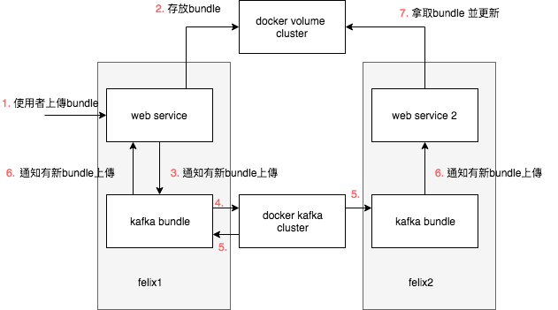

## 如何更新叢集bundle

### 參考工具：

* kafka

### 思路：

* 建立kafka相關的docker container
* 建一個跨網域的docker volume，docker_felix會mount它
* 一個bundle建立web界面的更新接收api，並向消息系統推送訊息producer，也實現更新邏輯
* 一個bundle建立接收消息系統的consumer及producer，並提供java api給同一個felix內的bundle傳遞/監聽消息

### 訊息傳遞順序


### 跨網域docker volume

* Ceph
* glusterfs
* 兩者比較 https://blog.csdn.net/swingwang/article/details/77012500

### 實作架構

1. web service:
```JAVA

@Component(service = NewBundleUploadServlet.class, property = "path=/api/update")
public class NewBundleUploadServlet extends RxServlet {


	/**
	 * 當注入KafkaHelper的時候，註冊監聽器，用來監聽KAFKA消費的事件。
	 * @param kafkaHelper
	 */
	@Reference(policy = ReferencePolicy.DYNAMIC, policyOption = ReferencePolicyOption.GREEDY, cardinality = ReferenceCardinality.MANDATORY)
	public void setKafkaHelper(KafkaHelper kafkaHelper) {
		this.kafkaHelper = kafkaHelper;
		kafkaHelper.registerListener(NewBundleUploadServlet.class.getName(), this::onKafkaNotify);
	}

	/**
	 * 當KafkaHelper停止運作的時候，反註冊監聽器，避免null pointer。
	 * @param kafkaHelper
	 */
	public void unsetKafkaHelper(KafkaHelper kafkaHelper) {
		this.kafkaHelper = null;
		kafkaHelper.unregisterListener(NewBundleUploadServlet.class.getName());
	}

	/**
	 * 當事件進來的時候，會觸發這個方法。
	 * @param message 定義好的KAFKA訊息
	 */
	private void onKafkaNotify(KafKaMessage message) {

		if (KAFKA_CHANNEL.equals(message.getChannel())) {
			String symbolicname = new JSONObject(message.getMessage()).getString("symbolicname");
			Bundle bundle = getbundle(symbolicname);
			if (bundle == null) {
				installBundle(symbolicname);
			} else {
				updateBundle(bundle);
			}
		}
	}

	/**
	 * 上傳檔案的實作
	 * @param req
	 * @param resp
	 * @throws Exception
	 */
  private void doUpload(HttpServletRequest req, HttpServletResponse resp) throws Exception {

		Boolean isMultipart = ServletFileUpload.isMultipartContent(req);

		resp.setContentType(MediaType.APPLICATION_JSON);

		if (!isMultipart) {
			resp.sendError(400);
			return;
		}

		DiskFileItemFactory factory = new DiskFileItemFactory();
		factory.setSizeThreshold(maxMemSize);
		File folder = new File(basePath);
		if (!folder.exists()) {
			folder.mkdir();
			log.info("folder.exists() = " + folder.exists());
		}
		factory.setRepository(folder);

		ServletFileUpload upload = new ServletFileUpload(factory);
		upload.setSizeMax(maxFileSize);

		try {
			List<FileItem> fileItems = upload.parseRequest(req);

			// Process the uploaded file items
			for (FileItem fi : fileItems) {
				if (!fi.isFormField()) {

					// Get the uploaded file parameters
					// String fieldName = fi.getFieldName();
					// boolean isInMemory = fi.isInMemory();
					long sizeInBytes = fi.getSize();
					log.info("file size = " + sizeInBytes);
					if (sizeInBytes == 0) {
						JSONObject jo = new JSONObject();
						jo.put("error", "file is empty");
						resp.setStatus(400);
						resp.getWriter().append(jo.toString()).close();
						return;
					}

					File tmpFile = new File(basePath + "/" + fi.getName());

					log.info("Uploaded Filename: " + fi.getName());

					fi.write(tmpFile);

					// send kafka symbolicname
					String symbolicname = getSymbolicName(tmpFile);

					if (symbolicname == null) {
						JSONObject jo = new JSONObject();
						jo.put("error", "symbolicname is null");
						resp.setStatus(400);
						resp.getWriter().append(jo.toString()).close();
						return;
					}

					if (!fi.getName().equals(symbolicname)) {
						tmpFile.renameTo(new File(basePath + "/" + symbolicname + ".jar"));
					}
					KafKaMessage message = new KafKaMessage();
					message.setChannel(KAFKA_CHANNEL);
					message.setMessage(new JSONObject().put("symbolicname", symbolicname).toString());
					kafkaHelper.sendKafkaMsg(message);
				}
			}
		} catch (EOFException e) {
			// TODO: handle exception
			log.debug(e.toString());
		} catch (Exception ex) {
			log.error("e:", ex);
		}

		resp.getWriter().append("{\"status\":\"success\"}").close();

	}
}
```

2. kafka message:
```JAVA

public class KafKaMessage {

	private String channel;
	private String message;

	public void setChannel(String channel) {
		this.channel = channel;
	}

	public void setMessage(String message) {
		this.message = message;
	}

	public String getChannel() {
		return channel;
	}

	public String getMessage() {
		return message;
	}

}
```

3. kafkaHelper:
```JAVA

@Component(service = KafkaHelper.class)
public class KafkaHelper {

	private static final HashMap<String, KafkaCallBack> listner = new HashMap<>();
	private boolean isStart = false;
	private KafkaProducer producer;
	private static final Logger log = LoggerFactory.getLogger(KafkaHelper.class);
	private final Gson gson;

	public KafkaHelper() {
		gson = new Gson();
	}

	public void registerListener(String key, KafkaCallBack back) {
		listner.put(key, back);
	}

	public void unregisterListener(String key) {
		listner.remove(key);
	}

	@Activate
	private void start(BundleContext context) {
		// TODO Auto-generated method stub

		log.info("===========================================");
		// Get the brokers
		String brokers1 = "tasks.kafka1:9092";
		BundleWiring bundleWiring = findJettyBundle(context).adapt(BundleWiring.class);

		isStart = true;

		Thread consumer = new Thread(() -> {
			try {
				String group = InetAddress.getLocalHost().getHostName();
				consume(brokers1, group);
			} catch (Exception e1) {
				// TODO Auto-generated catch block
				log.error("e", e1);
				isStart = false;
			}
		});
		consumer.setContextClassLoader(bundleWiring.getClassLoader());
		consumer.start();

		Thread producer = new Thread(() -> {
			try {
				produce(brokers1);
			} catch (Exception e) {
				// TODO Auto-generated catch block
				log.error("e", e);
				isStart = false;
			}
		});
		producer.setContextClassLoader(bundleWiring.getClassLoader());
		producer.start();

	}

	@Deactivate
	private void stop(BundleContext context) {
		isStart = false;
		if (producer != null) {
			producer.close();
		}
	}

	private Bundle findJettyBundle(BundleContext context) {
		return Arrays.stream(context.getBundles())
				.filter(b -> b.getSymbolicName().equals("org.apache.servicemix.bundles.kafka-clients")).findAny().get();
	}

	public void produce(String brokers) throws Exception {

		// Set properties used to configure the producer
		Properties properties = new Properties();
		// Set the brokers (bootstrap servers)
		properties.setProperty("bootstrap.servers", brokers);
		// Set how to serialize key/value pairs
		properties.setProperty("key.serializer", "org.apache.kafka.common.serialization.StringSerializer");
		properties.setProperty("value.serializer", "org.apache.kafka.common.serialization.StringSerializer");
		producer = new KafkaProducer<>(properties);

	}

	public void consume(String brokers, String groupId) throws Exception {
		// Create a consumer
		KafkaConsumer<String, String> consumer;
		// Configure the consumer
		Properties properties = new Properties();
		// Point it to the brokers
		properties.setProperty("bootstrap.servers", brokers);
		// Set the consumer group (all consumers must belong to a group).
		properties.setProperty("group.id", groupId);
		// Set how to serialize key/value pairs
		properties.setProperty("key.deserializer", "org.apache.kafka.common.serialization.StringDeserializer");
		properties.setProperty("value.deserializer", "org.apache.kafka.common.serialization.StringDeserializer");
		// When a group is first created, it has no offset stored to start reading from.
		// This tells it to start
		// with the earliest record in the stream.
		properties.setProperty("auto.offset.reset", "earliest");
		consumer = new KafkaConsumer<>(properties);

		// Subscribe to the 'test' topic
		consumer.subscribe(Arrays.asList("test"));

		// Loop until ctrl + c
		int count = 0;
		log.info("start consume");
		while (isStart) {
			// Poll for records
			ConsumerRecords<String, String> records = null;
			try {
				records = consumer.poll(Duration.ofSeconds(2));
			} catch (Exception e) {
				isStart = false;
			}

			if (records == null) {
				isStart = false;
				return;
			}

			// Did we get any?
			if (records.count() == 0) {
				// timeout/nothing to read
			} else {
				// Yes, loop over records
				for (ConsumerRecord<String, String> record : records) {
					// Display record and count
					count += 1;
					log.info(count + ": " + record.value());
					for (KafkaCallBack back : listner.values()) {
						if (back != null) {
							KafKaMessage message = gson.fromJson(record.value(), KafKaMessage.class);
							back.onCall(message);
						}
					}
				}
			}
		}
		consumer.close();
		log.info("stop consume");
	}

	public void sendKafkaMsg(KafKaMessage message) {
		String msg = gson.toJson(message);
		producer.send(new ProducerRecord<String, String>("test", msg));
	}
}

```
